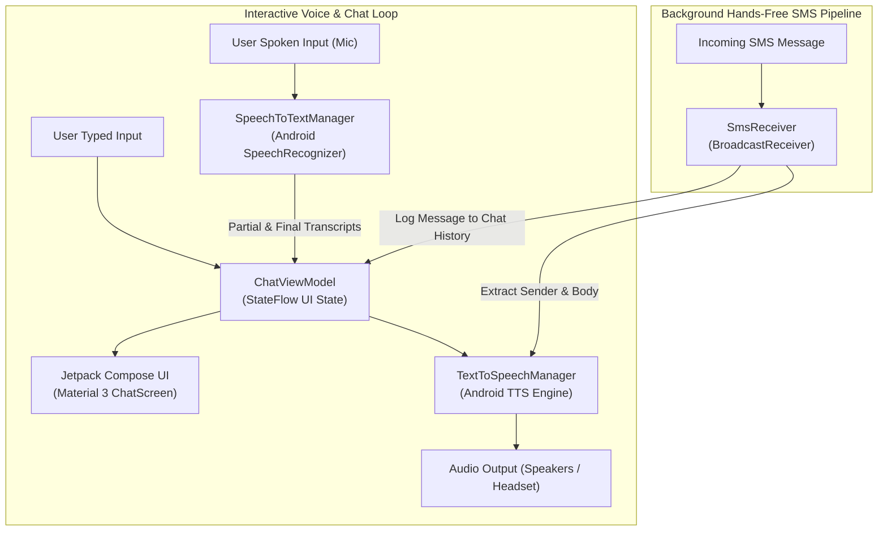

# Interpretive Interface

<p align="center">
  <a href="https://developer.android.com/about/versions/15"></a>
  <a href="https://kotlinlang.org/"></a>
  <a href="https://developer.android.com/jetpack/compose"></a>
  <a href="LICENSE"></a>
  <a href="CONTRIBUTING.md"></a>
  <a href="https://github.com/holman57/interpretive-interface/stargazers"></a>
</p>

**Interpretive Interface** is a voice-first, hands-free Android communication application engineered with **Jetpack Compose** and **Kotlin 2.0+**. It bridges multimodal voice interaction by combining continuous Speech-to-Text (STT), low-latency Text-to-Speech (TTS), an interactive chat UI, and an autonomous background SMS reader designed for accessible, eyes-free mobile communication.

> [!NOTE]
> Designed for Android 15 (Target SDK 35), Interpretive Interface enables safe, screen-free mobile interaction during commuting, driving, or accessibility-first workflows.

---

## Table of Contents

- [Architecture & Data Flow](#architecture--data-flow)
- [Key Capabilities](#key-capabilities)
- [Permissions & Security Model](#permissions--security-model)
- [Project Structure](#project-structure)
- [Requirements](#requirements)
- [Build & Installation](#build--installation)
- [Contributing](#contributing)
- [Show Your Support](#show-your-support)
- [License](#license)

---

## Architecture & Data Flow

Interpretive Interface pairs two concurrent operational pipelines: an **Interactive Voice-Chat Pipeline** and a **Hands-Free SMS Broadcast Pipeline**:



---

## Key Capabilities

- 🎙️ **Streaming Speech-to-Text (STT)**: 
  Continuous on-device voice recognition using Android's native `SpeechRecognizer` API with interim hypothesis streaming.
- 🔊 **Natural Text-to-Speech (TTS)**: 
  Immediate auditory playback of incoming messages, conversational answers, and notification summaries with configurable speech rates and pitch.
- 📲 **Autonomous SMS Audio Reader**: 
  Background `BroadcastReceiver` listens for incoming SMS events (`Telephony.Sms.Intents.SMS_RECEIVED_ACTION`), parses message headers, and immediately narrates sender and content aloud.
- 🎨 **Modern Jetpack Compose & Material 3 UI**: 
  Clean, responsive chat bubbles, dynamic mic activity indicators, dark mode adaptability, and smooth scroll animations.
- 🛡️ **Android 15 Permission Orchestration**: 
  Granular, runtime-safe permission requests for `RECORD_AUDIO` and `RECEIVE_SMS` with clear user consent flows.

---

## Permissions & Security Model

| Permission | Scope | Rationale |
| :--- | :---: | :--- |
| `android.permission.RECORD_AUDIO` | Runtime | Required for capturing microphone audio for real-time speech transcription. |
| `android.permission.RECEIVE_SMS` | Runtime | Required by `SmsReceiver` to capture incoming messages for hands-free audio narration. |
| `android.permission.INTERNET` | Install-time | Used when cloud-assisted STT/TTS language models or external APIs are connected. |

---

## Project Structure

```
interpretive-interface/
├── app/
│   ├── src/main/
│   │   ├── AndroidManifest.xml
│   │   └── java/net/lukeholman/interpretiveinterface/
│   │       ├── MainActivity.kt               # Compose host activity & permission coordinator
│   │       ├── data/
│   │       │   └── ChatMessage.kt            # Immutable UI chat message entity
│   │       ├── stt/
│   │       │   └── SpeechToTextManager.kt    # Android SpeechRecognizer wrapper
│   │       ├── tts/
│   │       │   └── TextToSpeechManager.kt    # Android TTS engine manager
│   │       ├── sms/
│   │       │   └── SmsReceiver.kt            # Broadcast receiver for incoming SMS
│   │       └── ui/
│   │           ├── ChatViewModel.kt          # UI StateFlow & business logic
│   │           └── ChatScreen.kt             # Jetpack Compose chat & voice interface
│   └── build.gradle.kts                      # App build configuration & dependencies
├── gradle/                                   # Gradle wrapper binaries & scripts
├── build.gradle.kts                          # Root project build configuration
├── settings.gradle.kts                       # Repository & module settings
├── LICENSE                                   # MIT License
└── README.md
```

---

## Requirements

- **Android SDK**: Min SDK 26 (Android 8.0 Oreo), Target SDK 35 (Android 15)
- **JDK**: Java 17+
- **Kotlin**: 2.0+
- **Gradle**: 9.0+

---

## Build & Installation

### Command Line
```bash
# Clone the repository
git clone https://github.com/holman57/interpretive-interface.git
cd interpretive-interface

# Build Debug APK
./gradlew assembleDebug

# Install on a connected physical device or emulator via ADB
./gradlew installDebug
```

### Android Studio
1. Open Android Studio (Ladybug or newer).
2. Select **Open** and choose the `interpretive-interface` directory.
3. Allow Gradle to sync dependencies.
4. Select your target device/emulator and click **Run (Shift + F10)**.

---

## Contributing

Contributions, UI improvements, and device testing feedback are welcomed!

1. Fork the project (`gh repo fork holman57/interpretive-interface`).
2. Create your feature branch (`git checkout -b feature/bluetooth-audio-routing`).
3. Commit your changes (`git commit -m 'feat: add Bluetooth SCO audio support'`).
4. Push to the branch and open a Pull Request.

---

## Show Your Support

If you find this voice-first Android project helpful, please give it a **⭐ Star** on GitHub and **🍴 Fork** it for your own experiments!

---

## License

This project is licensed under the [MIT License](LICENSE).
